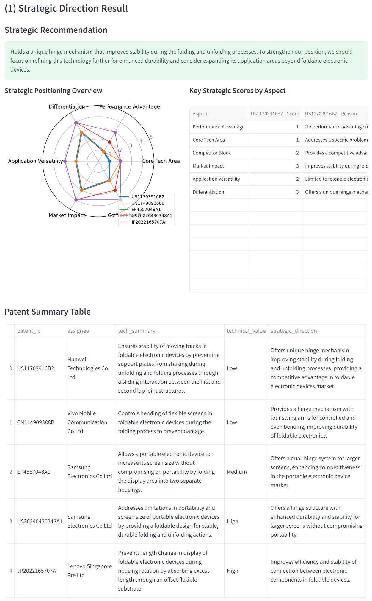
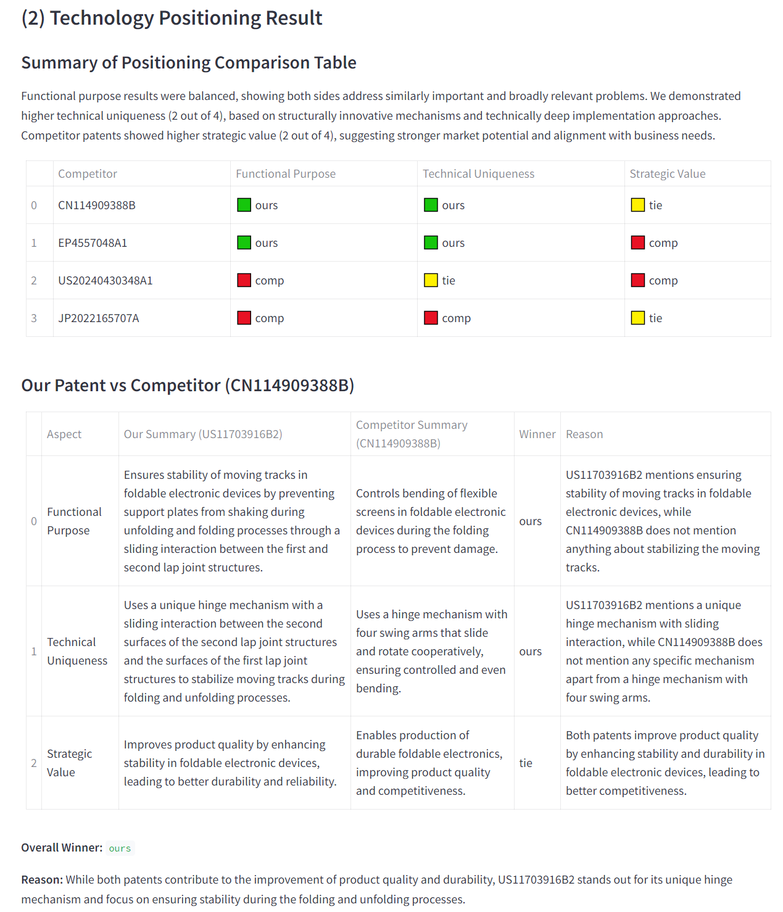
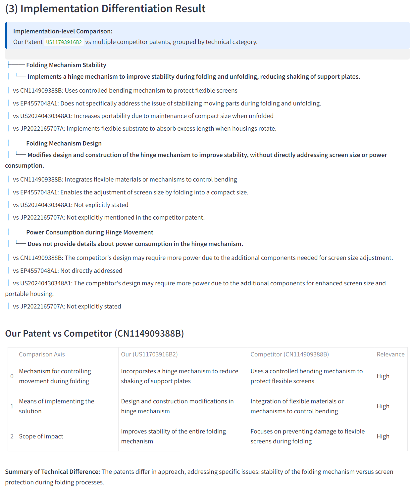

# 3-Layer Patent Comparison System

This is an AI-powered patent comparison system designed to support structured, repeatable, and strategic patent evaluation. By leveraging large language models (LLMs), it enables users to identify technical advantages, strategic positioning, and implementation-level differentiators between their patents and those of competitors.

## What is this system?

The 3-Layer Patent Comparison System replaces manual and subjective analysis with structured AI-driven comparisons across three expert-designed layers:

### 1. Strategic Direction – Provides a strategic guide for how your patent should be positioned or developed further

- Compares your patent with multiple competitors
- Aggregates similarity and relative value
- Generates a strategic recommendation based on the analysis

### 2. Technology Positioning – Determines which side has the technological and strategic upper hand.

- Compares a single patent pair across:
  - Functional Purpose
  - Technical Uniqueness
  - Strategic Value
- Provides axis-level winners and overall judgment

### 3. Implementation Differentiation  – Highlights how your technical design differs in structure and approach.

- Identifies 3–5 key implementation axes per patent pair
- Summarizes each side's solution
- Explains differences in structure, mechanism, or approach

This multi-layered insight supports more effective decision-making in R&D, IP management, and strategic investment planning.

## How to Use

Before using this system, it is assumed that your team has:
- Selected key patents from your company and competitors
- Filtered to focus on strategically important patent sets

### Steps:
1. Enter your company’s target patent number
2. Enter one or more competitor patent numbers
3. Run the analysis

The system will:
- Perform one-to-one comparisons
- Generate results using LLMs across the three layers
- Provide structured tables, insights, and strategy recommendations

## Author

Deokjin Choi  
Email: deokjin.choi@gmail.com

## License and Use Policy

This system is provided for personal, research, and portfolio use.

If you wish to apply this system in commercial, legal, or business-related settings, you must contact the author in advance for discussion.

## Acknowledgements

This project builds upon open-source LLM technologies and contributions from the AI and patent analytics community. Special thanks to the developers of Streamlit and foundational transformer models.
