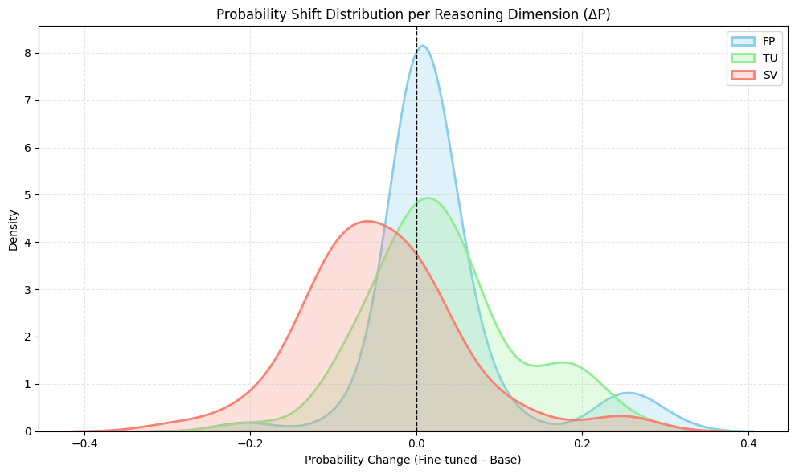
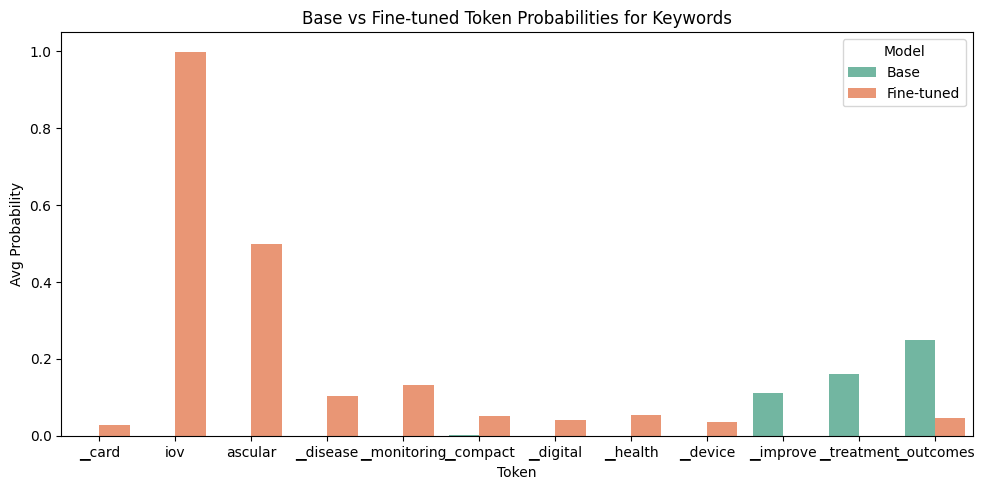
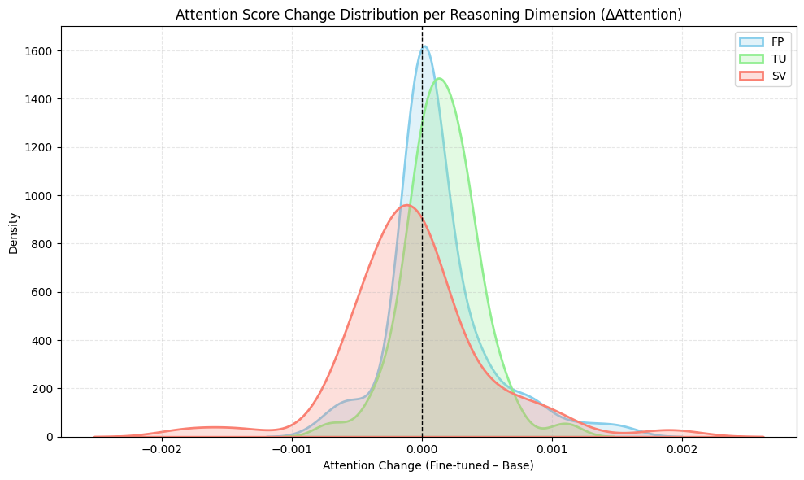
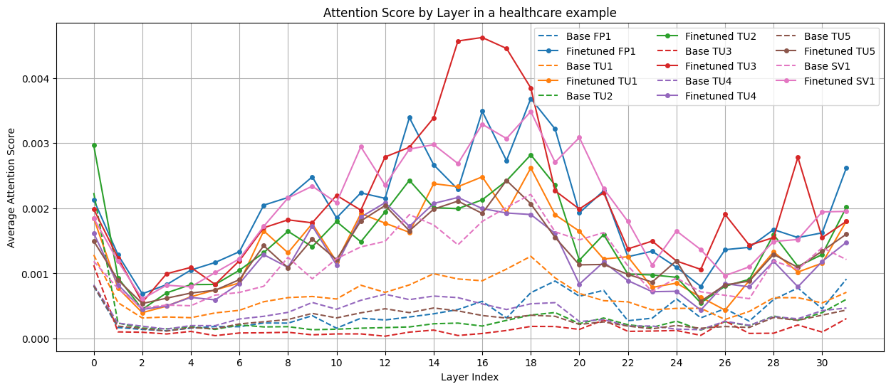

# Structured LLM-Based Patent Comparison (FP/TU/SV) with Bias Probing

**TL;DR** — We propose a structured framework for patent comparison using LLMs. Prompt refinement alone improves consistency, and Parameter-Efficient Fine-Tuning (PEFT, LoRA) reduces Strategic Value (SV) dominance, shifting reasoning toward Functional Purpose (FP) and Technical Uniqueness (TU).

---

## Motivation
Patent comparison using LLMs suffers from bias, inconsistency, and lack of transparency. These issues are critical when decisions involve **Functional Purpose (FP)**, **Technical Uniqueness (TU)**, and **Strategic Value (SV)**.  
We designed a structured framework with explicit decision logic, prompt refinement, and lightweight fine-tuning (PEFT) to **measure and mitigate bias** and improve reasoning alignment.

---

## Key Contributions
- **Three-Dimensional Comparison Framework**: Formalizes patent comparison along FP, TU, and SV.
- **Diagnostic Metrics**: Introduces Mismatch Rate, Shake Rate, and dimension-specific agreement metrics for consistency and bias analysis.
- **Prompt Improvement**: Demonstrates that revised prompts improve rule compliance, stability, and reliability.
- **Bias Mitigation via PEFT**: Shows that LoRA fine-tuning reduces SV-dominant justifications and strengthens FP/TU reasoning.

---

## Framework Overview
1. Extract **Problem–Solution–Effect** from patents.
2. Generate FP/TU/SV summaries and select winners with reasoning.
3. Aggregate results into final judgments through majority logic.
4. Run repeated evaluations (30×) and apply prompt variations to test stability.
5. Fine-tune with PEFT (LoRA) to mitigate SV dominance.

---

## Results Summary

**Prompt Refinement (Original → Revised):**
- **Mismatch Rate**: 23.2% → 11.3%  
- **Shake Rate**: 45.9% → 36.2%  
- **TU Kappa**: 0.022 → 0.359  
- **SV Kappa**: 0.299 → 0.703  

**Dominant Reasoning Axis (Validation Set):**

| Model                   | FP (%) | TU (%) | SV (%) |
|--------------------------|--------|--------|--------|
| Ollama (Inference Only) | 0.0    | 0.0    | 100.0  |
| Base (Pretrained)       | 39.6   | 31.0   | 29.3   |
| Fine-Tuned (LoRA)       | 57.3   | 25.3   | 17.3   |

- **Ollama baseline** shows complete dominance of SV-based reasoning (100%).  
- **Base model** distributes judgments more evenly but still exhibits SV reliance.  
- **LoRA fine-tuning** mitigates SV dominance and shifts reasoning toward FP/TU.

**Token/Attention Evidence:**
- Token probability shifts: FP +0.0282, TU +0.0328, SV –0.0423 
 
 
- Attention shifts: FP +1.22e−4, TU +1.52e−4, SV –5.9e−5  
 
 

---

## Repository Structure

```
.
├── data
│   ├── peft                  # Data and results for PEFT fine-tuning
│   │   ├── attention         # Attention analysis results
│   │   ├── figs              # Analysis visualizations (heatmaps, KDE plots, etc.)
│   │   ├── justifications    # Reasoning outputs for base and fine-tuned models
│   │   ├── lora_output       # Fine-tuned LoRA adapter model
│   │   ├── token_probs       # Data used for token probability analysis
│   │   ├── fine_tuned_train.jsonl    # Fine-tuning training data
│   │   └── fine_tuned_valid.jsonl    # Fine-tuning validation data
│   ├── prompts               # Prompt data
│   │   ├── origin            # Original prompts
│   │   └── revised           # Revised prompts
│   ├── raw                   # Raw patent data (in JSON format)
│   └── summary               # Summarized patent data (in JSON format)
└── src
    ├── metrics_utils.py      # Metrics calculation utility
    ├── peft_analyze_attns.py # Attention analysis script
    ├── peft_analyze_probs.py # Token probability analysis script
    ├── peft_generate_outputs.py # Script for generating outputs from the base and fine-tuned model
    ├── peft_train.py         # PEFT fine-tuning training script
    ├── prompt_eval.py        # Prompt evaluation script
    └── prompt_run.py         # Prompt execution script
└── result_figures            # Main result figures in the paper

```

## Quick Reproduce
- **Prompt comparison**: `src/prompt_eval.py`  
- **Generate base/fine-tuned outputs**: `src/peft_generate_outputs.py`  
- **Analyze token/attention shifts**: `src/peft_analyze_probs.py`, `src/peft_analyze_attns.py`  

Dependencies are listed in `requirements.txt`.

---

## Limitations
- Current study is limited to English and a single LLM (Mistral-7B).
- Variability remains in domains with subtle technical differences.
- Future work should extend to multilingual datasets and diverse model families.

---